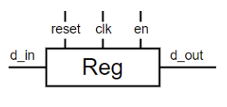
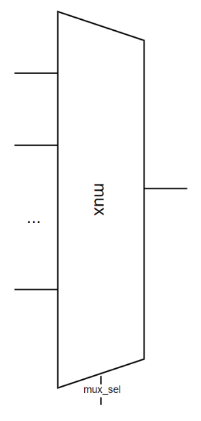
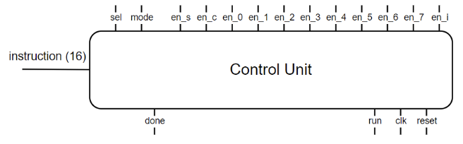
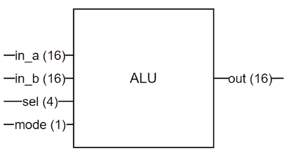
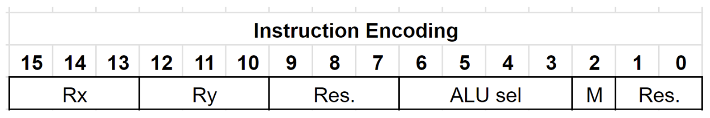

# Notes


### Bitty Structure Image


* It have 8 register that can stro 16-bit data. 
* Multiplexer that can programmatically perform operations supported by 74181 ALU. (Already designed in Verilog)
* The processors's brain is a Control Unit, which is basically finite state machine.
* Data feed into this system through the 16-bit DIN input, which is loaded into the instruction register (Reg Inst)
* Data can be shuffled around using the 16-bit wide multiplexerm. Moving stuff from the register to one of the general-purpose registers R0 to R7. 
* Output of Multiplexer called bus-wires in the diagram describing the wiring that lets data moe from one place to another in the system.
* The final state machine controls which input of the multiplexer gets selected, so you can transfer data from any input to any register that's hooked p to the bus wires.


## Each component Description 

#### Register 


It is a storage box in computer's proccessor that holds small amout of data temporarily.
* It is fast and used to quick access to important information needed for calculations and other operatoins.

The behavior of the register is essentially a 16-bit D flip-flop with an enable singal. This means that on the positive edge of the clock, it captures and stores the input data only if the enable singal is high. If the enable siganl is not asserted, the register continuously ouputs the data that was last written to it.

#### Multiplexer (MUX)


Switchboard operator for digital signals. It takes multiple signals and decided which singal is connected to the output.

Verilog code example for the MUX, which has 7 inputs, where each input has 16 bits capacity. 

```verilog
module mux(
    input [15:0] in[7:0], // 7 inputs as an matrix 
    input [4:0] sel, // select
    output reg [15:0] out // output
);
```

#### Contol Unit



Brain of out processor. Responsible for enabling and disabling specific parts of our processor, depending on the instruction currently processing.

It reads the instruction, decodes it and then sends the necessary control signals to the other components to execute the instruction. Keep everythings in sync and running smoothly.

#### ALU



Arithmetic Logic Unit of the processor... Already described in the labs.

#### Executing Instructions



Instuction tells the processor what kind of operands it should operate on and which operatoin it should perform on those operands. This information is encoded as a number, in our case 16-bit number, with different bits in that number representing different aspects of the instruction. This ecnoding allows processor to understand and execute a wide variety of operations, making it a powerful and versatile tool for computing.

